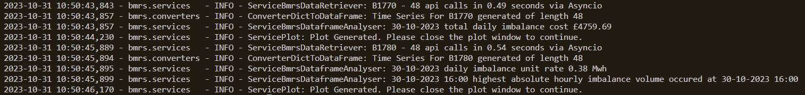
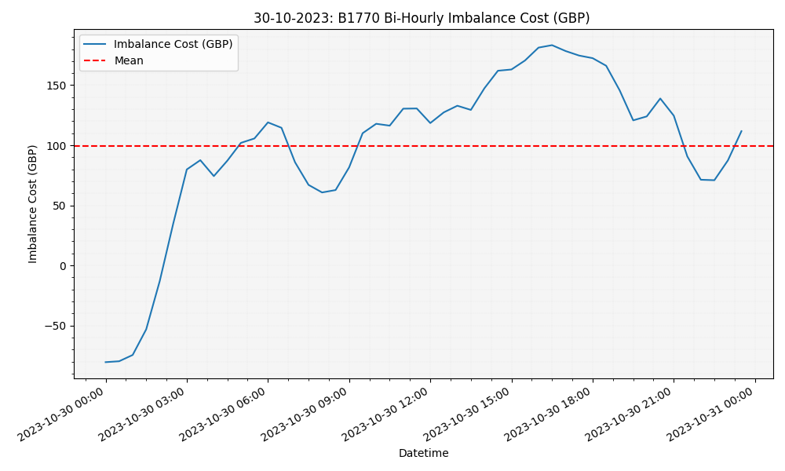
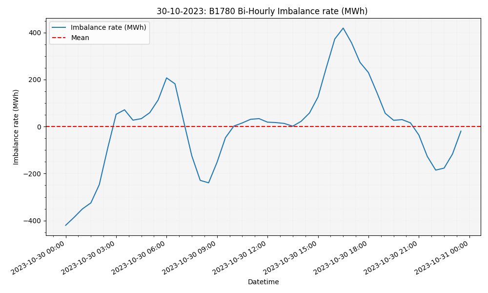

 
# **BMRS** - Trading Data

## Setup Bmrs

|Action|Command
| :-| :-
|Create a virtual environment| python -m venv .venv
|Install relevant libraries | pip install -r requirements.txt|
|Create .env | Populate with Environment Variables [var=value]|
|Create launch.json file| Open and Paste contents of launch_items.txt (ensure commas are correct) and Save|
|Run|Select Dropdown Menu and Select Run main|

## Environment Variables

|Environment variable|value|
| :-| :-
|MAX_TRIES | 3
|TIMEOUT | 20
|VERSION | V1
|MAX_CONCURRENCT_TASKS| 24
|RATE_LIMIT_SLEEP_TIME| 30 
|B1770_COLUMN|  imbalancePriceAmountGBP
|B1780_COLUMN|  imbalanceQuantityMAW
|API_SCRIPTING_KEY | Insert Scripting key Generated
|HOST| https://api.bmreports.com/BMRS/
|URL_END_STR| {SettlementDate}&Period={Period}&ServiceType={ServiceType}

# Disclaimer

This trading research repository was created as a proof of concept and should not be utilized in a trading environment. The code in this repository is provided for educational purposes only, and it is the sole responsibility of the user to determine whether the code is suitable for their intended use. The author of this repository does not make any representation or warranty as to the accuracy, completeness, or reliability of the information contained herein. The user should be aware that there are risks associated with trading and that trading decisions should only be made after careful consideration of all relevant factors. The author of this repository will not be held responsible for any losses that may result from the use of this code.

# Executive Summary

This repository includes code designed to query BMRS reports (Balancing Mechanism Reporting Service). The primary demonstration of this functionality is encapsulated in the `ServiceRunMain` class.

# Methodology

## Decorators

Decorators are utilized in your code to import environment variables, and this approach is indicative of best practices:

- **Security:** By leveraging environment variables, sensitive information, and configurations are kept out of the actual code. This ensures that the data remains secure, especially when shared or stored in repositories.

- **Modularity:** Decorators provide a way to modularly enhance or modify functions without changing their actual code. In the context of environment variables, they allow dynamic fetching of configurations, ensuring the core function remains unchanged.

## URL Builder

The `ServiceBmrsBuildUrl` service is a specialized URL generator tailored for fetching BMRS reports. It validates input parameters to ensure the correct data types and values are used, thus creating well-formed URLs. The service is designed to be flexible and extendable, allowing for the addition of new report queries without the need to alter the existing code structure. It incorporates comprehensive error checking, which guarantees that only valid URLs are generated for API calls.

## Date Retrieval Via Asyncio

I've enhanced the efficiency of the 'service_bmrs_data_retriever' through the integration of asyncio, a Python standard library adept at managing concurrent operations, particularly in scenarios that entail frequent API requests.

**Event Loop & Concurrent Tasks:** At the heart of this optimization is the Event Loop, a mechanism that facilitates multiple tasks to run concurrently. Instead of making a call and waiting for its completion, the Event Loop allows the initiation of another task during idle times inherent in operations like API calls.

**Efficient Resource Utilization:** This approach optimizes resource utilization, ensuring that the system is always engaged, rather than being stalled by wait times in sequential tasks.

**Regulation with MAX_CONCURRENT_TASKS:** While concurrency can drastically improve speed, unchecked simultaneous requests could potentially overwhelm a server. To circumvent this, I've implemented the MAX_CONCURRENT_TASKS parameter. This limits the number of tasks concurrently accessing the API, striking a balance between rapid data retrieval and ensuring server stability.

## Data Conversion and Analysis

To ensure the robustness and clarity of our data processing, I've employed a modular approach:

**Converter:** The initial step involves decoupling the conversion process from dictionary to dataframe. The converter is tailored to guarantee type consistency and rigorous checking, ensuring data reliability.

**Service_bmrs_dataframe_analyser:**

- **B1770 Report:** For this report, the focus is to aggregate the total daily imbalance cost. By accumulating values from a designated column, we gain a concise view of the daily imbalance expenditure.

- **B1780 Report:** This analysis is more nuanced. Initially, the aggregate of all imbalances is identified. This cumulative value is then normalized against the number of dataframe entries, yielding the daily imbalance unit rate. This rate offers a snapshot of average imbalance per unit time. Moreover, the _calculate_absolute_imbalance_volumes function refines the analysis by examining the magnitude of imbalances, disregarding their direction. Through hourly data resampling, we can discern the hour of maximum absolute imbalance, highlighting periods of peak deviation.

## Testing

In this repository, I have developed and implemented a comprehensive suite of tests, ensuring robustness and reliability across various components. The test cases are designed with precision emphasizing functionality, edge case coverage, and system stability.

- **Decorator Tests (TestAllDecoratorsTestCase):**  These tests validate decorators: `bmrs_api_vars_required`, `aiohttp_params_required`, and `report_column_headers_required`. They ensure essential parameters and report headers are correctly injected and handled, showcasing the effectiveness of these decorators in streamlining function configurations.

- **ServiceBmrsBuildUrl Tests:** These tests confirm the accuracy of URL construction for the BMRS API, ensuring that URL generation aligns precisely with specified parameters.

- **ServiceBmrsDataRetriever Tests:** These tests validate the functionality of data retrieval, including handling invalid report names and rate limit exceptions, ensuring the class operates effectively under various conditions.

- **ConverterDictToDataFrame Tests::** Aimed at verifying the accurate conversion of dictionaries to pandas DataFrames, these tests ensure data integrity and correct data type handling. Additional measures like logger mocking focus on core functionality without external interference.

The tests employ mocks and patches where necessary to isolate components, enhancing test accuracy and efficiency. This testing methodology not only bolsters the reliability of individual components but also reinforces the overall dependability of the software.

# Output

### Logging visualization showcasing the efficiency and low latency of asynchronous API calls and the outputs required by the task

### Visualization of B1770 report data Time Series

### Visualization of B1780 report data Time Series

# Future Developments
**Comprehensive Unit Testing:**
While the repository currently includes unit tests, comprehensive testing is crucial to ensure the reliability and robustness of the code. Future development should aim to:

- Achieve full test coverage for all services.
- Implement tests for edge cases and potential anomalies that may arise from changes in the BMRS data or updates to external libraries.
- Continuously update tests when new features are added or when significant changes are made to existing code.

**Extended Report Handling:** 
The current modular design of the 'service_bmrs_data_retriever' is versatile, allowing querying of any report type. However, to fully harness the capability of the BMRS platform, further enhancements are necessary:

- Develop and integrate parsers or converters tailored to the unique structure of each BMRS report.
- Ensure that the system is equipped to handle the vast array of response formats and data structures that different BMRS reports may present.

**Optimised Asycnio Event Loop Error Handeling and Rate limit logic:**

- Implement sophisticated error handling within the asyncio event loop to manage exceptions and operational errors seamlessly. 
- Create robsut timeout handelling to allow this service to retireve 1000's of datapoints 
